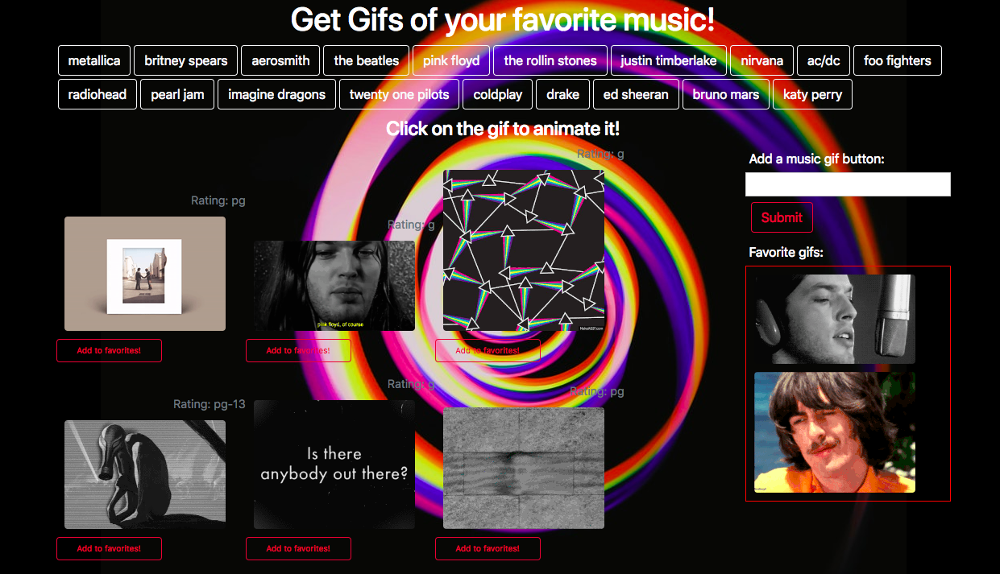

# GifTastic

Game: GifTastic \
Created for: Northwestern Coding Bootcamp \
Developer: Natalia Kukula \
Deployment Date:  October 10, 2018 \
Published: GitHub <https://nataliakukula.github.io/GifTastic/> \
Built with: HTML5, CSS3, Bootstrap, AJAX, Javascript & jQuery

## Summary: 

* The user gets a response from the GIPHY API by clicking a button with the name of the musician and displaying 10 gifs to the screen.

* The user gets to add their own button with their favorite musician.

* The user can click a button to add a particular gif to a list of favorites.

## Notes:

First homework accessing API's
